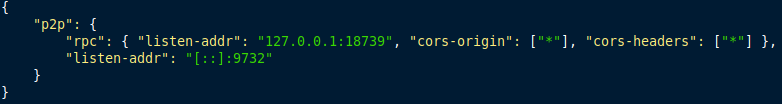

# tzcrow

## Project setup
```
npm install
```

### Compiles and hot-reloads for development
```
npm run serve
```

### Compiles and minifies for production
```
npm run build
```

### Run your tests
```
npm run test
```

### Lints and fixes files
```
npm run lint
```

### Customize configuration
See [Configuration Reference](https://cli.vuejs.org/config/).

### If $/.tezos-node/config.json file is missing
Go to tezos folder and run, 
```
./tezos-node config init
```
the file will be created in $/.tezos-node/config.json.

### Localhost execution 
Go to /tezos folder, and to start a node on the alphanet run, 
```
./src/bin_node/tezos-sandboxed-node.sh 9 --connections 1
```

Once your node is up and runnning go to $/.tezos-node/config.json and alter the config.json file.
In there change the rpc listenning port to your node port.

Example:



